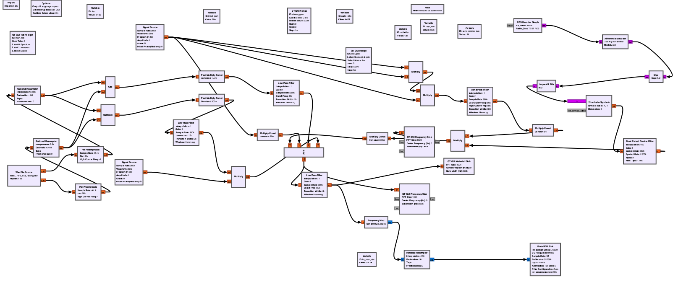
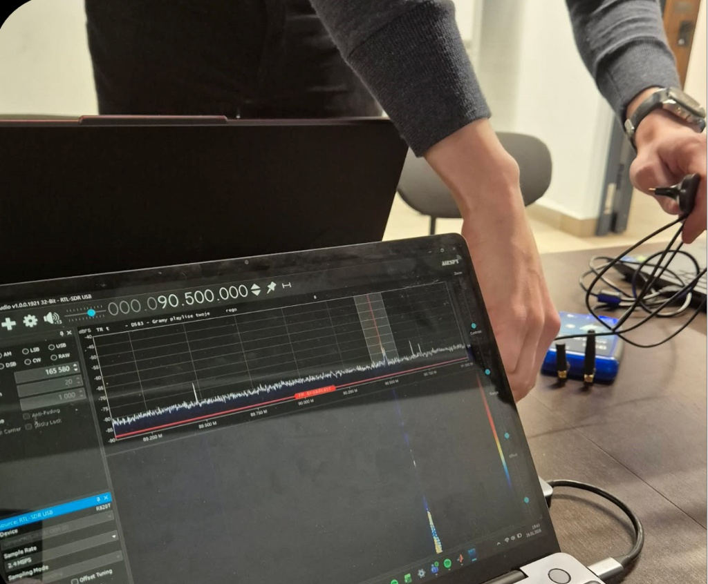
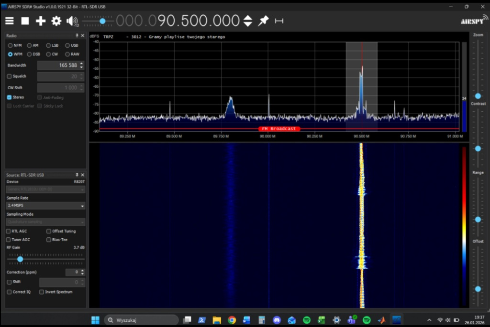

# SDR FM Transmitter with Custom RDS Encoder

## Overview
This repository contains a fully functional Software Defined Radio (SDR) flowgraph developed in GNU Radio Companion. It implements a Wideband FM (WBFM) transmitter complete with a custom, written-from-scratch **Radio Data System (RDS)** baseband encoder. 

## System Architecture

### Key Signal Processing Stages:
1. **Audio Path:** WAV file ingestion, resampling, and Wideband FM Modulation (Audio source files excluded due to copyright).
2. **RDS Baseband Generation:** A custom Embedded Python Block (`RDS Encoder Simple`) generating raw RDS bits.
3. **Subcarrier Modulation:** Moving the baseband RDS bitstream to the standard **57 kHz subcarrier**.
4. **Multiplexing:** Combining the WBFM audio, the 57 kHz RDS subcarrier, and the **19 kHz Pilot Signal** into a single complex baseband signal.
5. **Hardware Transmission:** Streaming the final complex signal via `Pluto Sink` to physical SDR hardware (Adalm Pluto) at a 2 MS/s sample rate.

## The Custom L2 RDS Encoder (Python)
Standard GNU Radio comes with basic RDS blocks, but this project implements a custom Python block to demonstrate a deep understanding of the RDS standard.

### Features of the Custom Block:
* **Framing & Sync:** Implements correct 104-bit group assembly, including 10-bit Checkword (CRC/Syndrome) calculation and A/B/C/C'/D Offset Word masking for receiver synchronization.

## Tech Stack
* **Software:** GNU Radio Companion 3.10+, Python 3, NumPy
* **Hardware Compatibility:** PlutoSDR (via Sink)

## Real-World Hardware Verification 🧪

Theoretical DSP logic is one thing, but physical execution is where true verification happens. To prove the bit-exactness of the custom Python L2 encoder, the flowgraph was executed using physical SDR hardware. 

The generated RF signal was transmitted over the air and successfully decoded by a separate SDR receiver setup.

### Test Bench Setup

*Transmission via SDR demonstrating hardware-in-the-loop (HIL) testing capability. Note the practical use of a simple wire configured as a loop antenna, which proved sufficient for near-field RF verification.*

### Successful L2 Payload Decoding

*Decoding of an arbitrary custom payload via SDR#. The Station Name (PS: "TRPZ") and a custom long-form Radio Text ("gramy playlsite twojego starego") were dynamically injected and successfully parsed by the receiver software. This definitively verifies the CRC generation, offset masking, block synchronization, and dynamic text segmentation logic implemented in the Python block.*